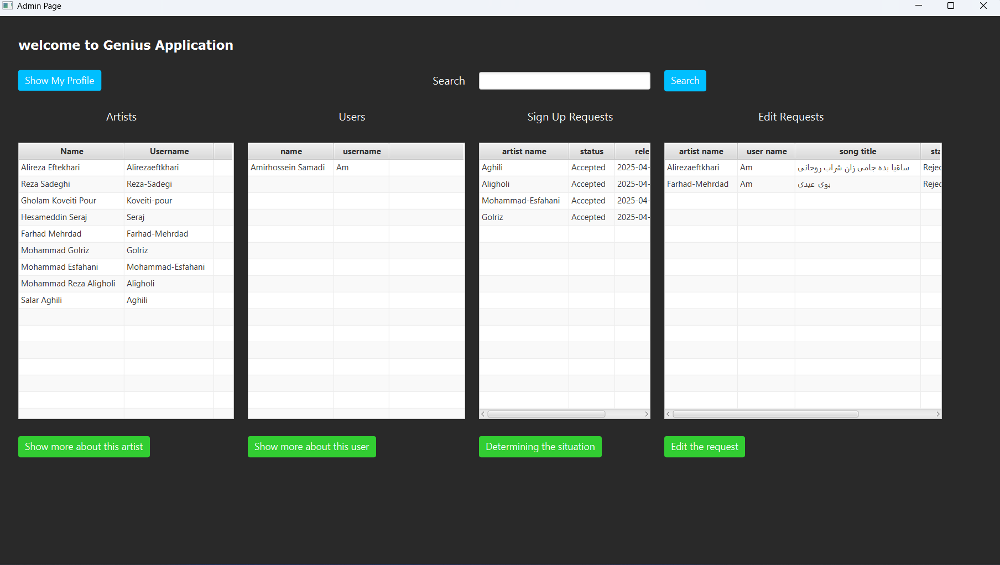
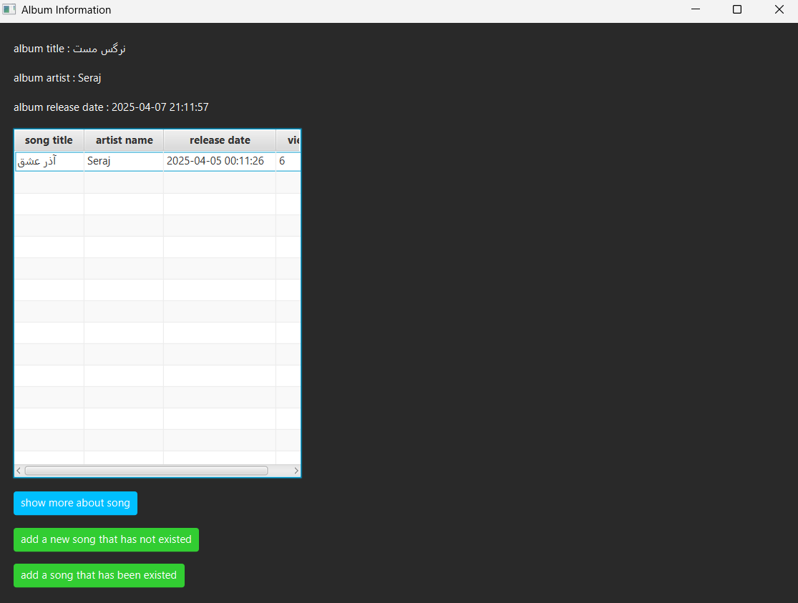

# 🎵 Genius Clone - Local Lyrics & Music Platform

A local Java-based clone of the **Genius.com** music platform, built as a midterm project for the *Advanced Programming* course (Spring 2025). This application allows users to explore song lyrics, interact with artists, and manage music content in an interactive GUI using **JavaFX**, with secure login and persistent data powered by **SQL**.

---

## 📚 Table of Contents
- [Description](#description)
- [Features](#features)
- [Usage](#usage)
- [Tech Stack](#tech-stack)
- [Screenshots](#screenshots)
- [Bonus Features](#bonus-features)
- [Changelog](#changelog)
- [Credits](#credits)
- [Contact](#contact)

---

## 📝 Description

This project simulates the core functionality of the Genius music platform, focusing on **Object-Oriented Programming** principles. Users can register as either **Listeners**, **Artists**, or operate as **Admins**, each with their own role-specific features.

---

## 🚀 Features

### 👤 Accounts
- Sign up / login with secure **hashed passwords**
- Register as either:
  - **Listener**: view lyrics, comment, follow artists, suggest edits
  - **Artist**: upload songs/albums, approve suggestions, manage own content
  - **Admin**: verify artist accounts, approve lyrics when artists are inactive

### 🎶 Songs & Albums
- Artists can create albums and songs with full metadata
- Songs support featured artists, tags, genres, comments, and view counts

### 💬 Comments
- Users can leave and view comments sorted by date
- Username of commenter is displayed

### 📈 Charts & Discovery
- Popular songs chart (by views)
- Search functionality (songs, artists, albums)

### 🤝 User Interaction
- Follow artists
- View feed from followed artists (new songs & albums)

### 📄 Data Initialization
- Project includes **seed data**: users, artists, songs, albums, and comments

---

## 🧑‍💻 Usage

1. **Clone the project**:
    ```bash
    git clone https://github.com/yourusername/genius-clone-java.git
    cd genius-clone-java
    ```

2. **Build the project** using Gradle:
    ```bash
    mvn clean install
    ```

3. **Dependencies**
    ```bash
    implementation 'org.xerial:sqlite-jdbc:3.43.2.0'
    implementation 'org.mindrot:jbcrypt:0.4'
    ```

4. **Run the application**:
    - Launch the JavaFX GUI using your IDE or:
    ```bash
    java -jar target/genius-clone.jar
    ```

5. **Login/Register** as a new user and explore the app!

---

## 🛠️ Tech Stack

- **Java 17**
- **JavaFX** – for the GUI
- **SQL (e.g., SQLite/PostgreSQL)** – for data persistence
- **BCrypt / SHA algorithms** – for password hashing
- **Gradle** – build management

---

## 📸 Screenshots

> *(Insert GUI screenshots here showing the login screen, song view, artist profile, etc.)*








---

## 🌟 Bonus Features

Implemented from the optional bonus list:
- ✅ **JavaFX GUI**: modern interactive interface with scene navigation
- ✅ **Password Hashing**: secure credential management
- ✅ **SQL Database**: robust data storage and relationships

---

## 🧾 Changelog

### v1.0 – April 2025
- 🎉 Initial release with full feature set and GUI
- ✅ Bonus: JavaFX, hashed passwords, SQL database

---

## 🙏 Credits

- Instructor: **Dr. Saeed Reza Kheradpisheh**
- JavaFX documentation and tutorials
- PostgreSQL/SQLite SQL tutorials
- Genius.com – UI & feature inspiration

---

## 📬 Contact

**Developer:** Amirhossein Samadi  
**Email:** hamidbook2022@gmail.com
**GitHub:** [github.com/Amirhossein-Samadi](https://github.com/Amirhossein-Samadi)

---

## 📄 License

This project is developed as a university assignment and is not for commercial use.
